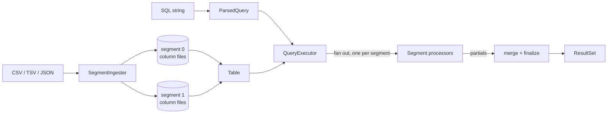
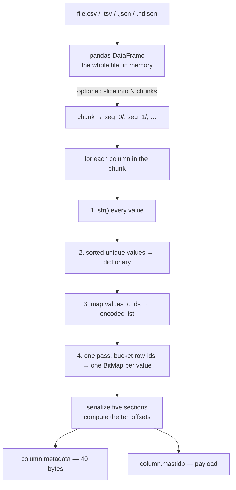
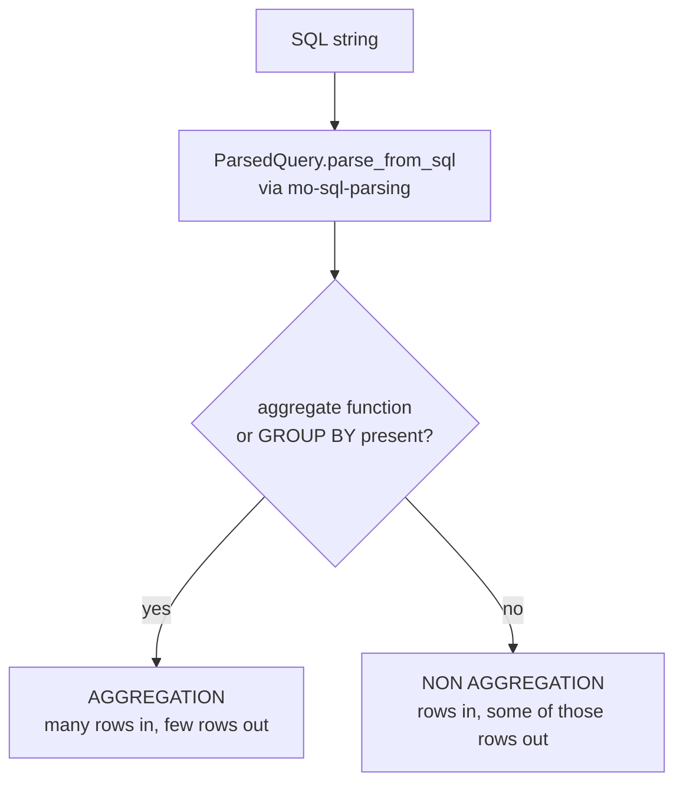
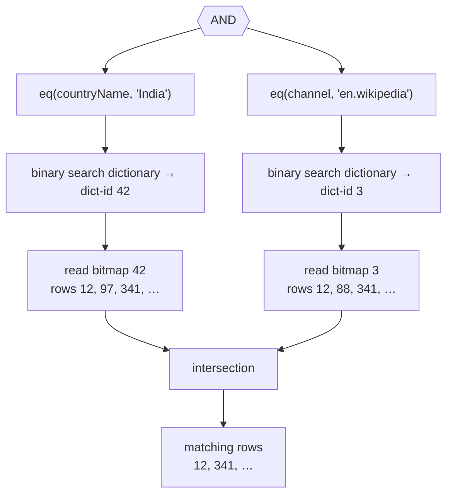
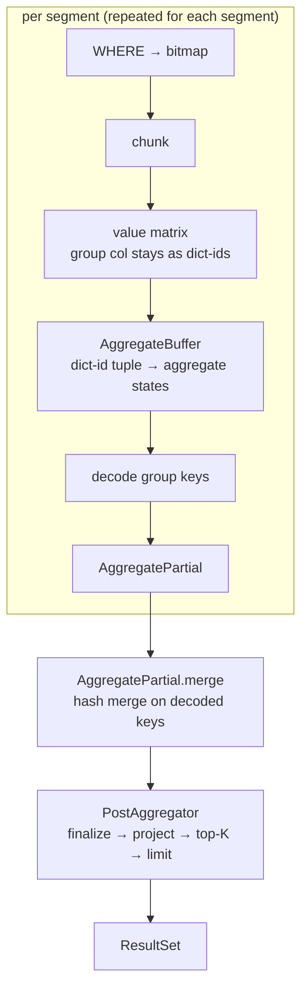
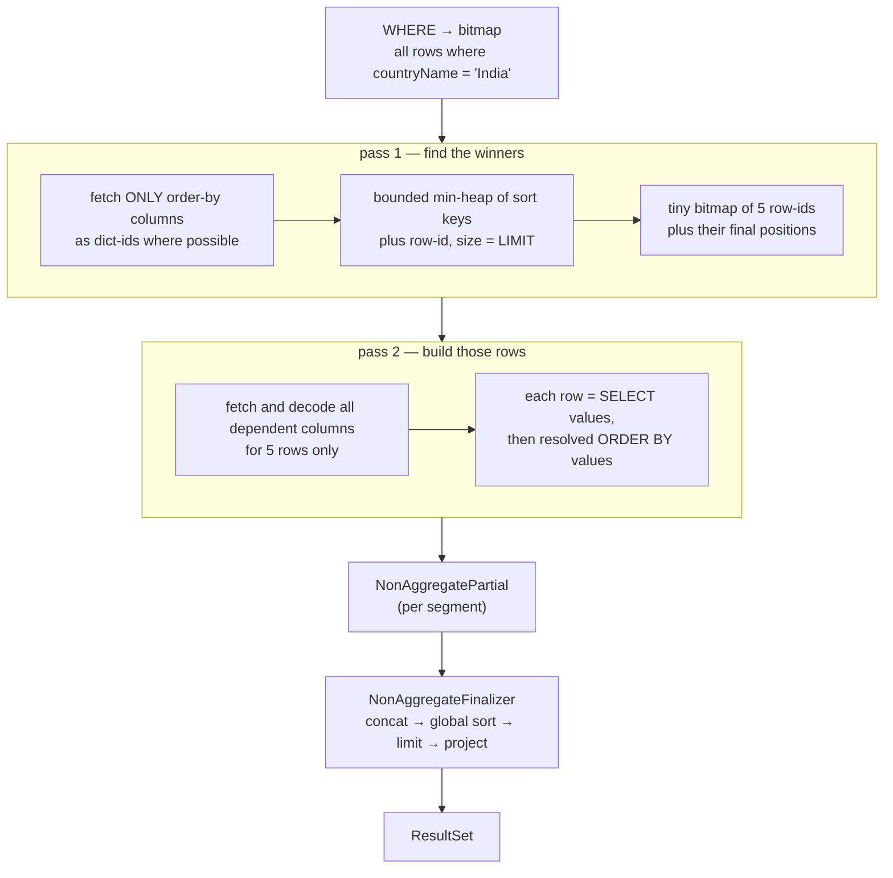

<p align="center">
  
</p>

# MastiDB Design & Architecture

This is the long version — the document I wish existed for every database I've tried to read.
It walks through how bytes are laid out on disk, what happens when you ingest a file, and what happens when you run a query. Wherever a design choice costs space or buys speed, I've called it out, because that trade is the whole point of an OLAP engine.

If you only want to run the thing, the [README](README.md) is enough. If you want to know *why* a `GROUP BY` over a million rows finishes in a blink, keep reading.

**Contents**

1. [Vocabulary](#1-vocabulary)
2. [Storage architecture](#2-storage-architecture)
3. [The ingestion path](#3-the-ingestion-path)
4. [The query path](#4-the-query-path)
5. [Aggregate queries, in detail](#5-aggregate-queries-in-detail)
6. [Non-aggregate queries, in detail](#6-non-aggregate-queries-in-detail)
7. [Invariants & where the code lives](#7-invariants--where-the-code-lives)
8. [Where the time actually goes](#8-where-the-time-actually-goes)
9. [Rough edges](#9-rough-edges)

---

## 1. Vocabulary

Four words, used consistently everywhere in the code:

| Word | What it means |
| --- | --- |
| **Table** | The logical thing you query. Holds one or more segments with the same schema. |
| **Segment** | A self-contained horizontal slice of the table, living in one directory on disk. Knows nothing about other segments. |
| **Column** | One column of one segment: two files on disk, dictionary-encoded, with a bitmap index per distinct value. |
| **Partial** | Half-finished query state coming out of a segment, before anyone merges or finalizes it. |

A table with three segments and nine columns is 27 columns on disk — 54 files. Segments are the unit of storage, the unit of work, and eventually the unit of parallelism.

Here's the whole engine on one page, so the rest of the document has somewhere to hang:



---

## 2. Storage architecture

### 2.1 Folders

A data directory is either **one flat segment** or **a folder of segments**. MastiDB decides by looking for `*.mastidb` files directly inside it.

```text
/tmp/wikidata/                     ← single segment (flat)
├── countryName.mastidb            ← the column payload
├── countryName.metadata           ← 40 bytes of offsets
├── cityName.mastidb
├── cityName.metadata
├── added.mastidb
└── added.metadata

/tmp/menuitem_multi/               ← a table of 2 segments
├── seg_0/
│   ├── price.mastidb
│   ├── price.metadata
│   └── … one pair per column
└── seg_1/
    ├── price.mastidb
    └── …
```

There is no catalog file, no schema registry, no manifest. The schema *is* the set of filenames, and `Table.from_data_dir` recovers it by listing the directory. Cheap and honest for a learning engine — and the first thing you'd replace if you wanted segment pruning, since pruning needs per-segment value ranges that nobody is writing down yet.

### 2.2 Two files per column

Metadata is kept out of the payload file on purpose. Reading a column's metadata is a tiny, cold, whole-file read (40 bytes), while reading the payload is a memory-mapped, random-access affair. Mixing them would mean every payload offset needed a header adjustment, and every metadata read would fault in a page of data you don't want.

### 2.3 The metadata file: 40 bytes, ten integers

`SegmentColumnMetadata` is ten 4-byte native ints, `struct.pack('i' * 10, …)`. That's it — no padding, no magic bytes, no checksum.

```text
byte  0     4     8     12    16    20    24    28    32    36    40
      ├─────┼─────┼─────┼─────┼─────┼─────┼─────┼─────┼─────┼─────┤
      │ ver │uniq │rows │  A  │  B  │  C  │  D  │  E  │ end │type │
      └─────┴─────┴─────┴─────┴─────┴─────┴─────┴─────┴─────┴─────┘
        1     107  24433   0    432  1324 99056 99484 114588  1

      ver   format version (1)
      uniq  uniq_value_count — dictionary cardinality
      rows  row_count
      A     offset_dictionary_offsets  (always 0)
      B     offset_dictionary
      C     offset_list
      D     offset_bitmap_offsets
      E     offset_bitmaps_list
      end   end_offset — also the payload file size
      type  1 = DIMENSION, 2 = METRIC (only DIMENSION is written today)
```

Those numbers are real: they're the `countryName` column of the Wikipedia edits dataset — 24,433 rows, 107 distinct countries, 114,588 bytes of payload.

Everything the engine needs to jump into the middle of a column is in these ten integers. No section headers inside the payload, no scanning to find where the bitmaps start. One 40-byte read and you can seek anywhere.

### 2.4 The payload file: five sections, back to back

A `.mastidb` file is a stack of five sections, in this order. The metadata offsets are the boundaries between them.

```text
                        ┌──────────────────────────────────────────────┐  0
   1. dictionary        │  int32 × (uniq + 1)                          │
      offsets           │  [0, 5, 14, 20, …]                           │
                        │  108 × 4 = 432 bytes                         │
                        ├──────────────────────────────────────────────┤  432
   2. dictionary        │  sorted UTF-8 values, no separators           │
                        │  "Argentina" "Australia" "Austria" …          │
                        │  892 bytes                                    │
                        ├──────────────────────────────────────────────┤  1324
   3. encoded list      │  int32 × rows — one dict-id per row           │
                        │  [42, 42, 7, 0, 7, 7, 42, …]                  │
                        │  24433 × 4 = 97,732 bytes   ← the bulk         │
                        ├──────────────────────────────────────────────┤  99056
   4. bitmap offsets    │  int32 × uniq — absolute file offsets          │
                        │  [99484, 99612, …]                            │
                        │  107 × 4 = 428 bytes                          │
                        ├──────────────────────────────────────────────┤  99484
   5. bitmaps           │  per distinct value: [len:uint32][roaring…]    │
                        │  15,104 bytes                                 │
                        └──────────────────────────────────────────────┘  114588
                                                                     = end_offset
```

Three of the five sections are pure fixed-width `int32` arrays. That is deliberate: fixed width means **the address of the i-th element is arithmetic, not a search**. Reading row 900,000's dict-id is `offset_list + 900000 * 4`, one page fault, no index traversal.

The two variable-length sections each get their own escape hatch:

**Dictionary values** are concatenated with no delimiters, so section 1 stores where each one starts. Value `i` lives at `[offsets[i], offsets[i+1])`, which is why the offsets array has `uniq + 1` entries — the extra trailing entry is the end of the last string, so no value needs special-casing.

```text
reading dictionary value #2
     offsets:  … │ 14 │ 20 │ …            ← two int32 at offset_dictionary_offsets + 2*4
                    │     └────────────┐
     dictionary: … A u s t r i a … ─────┤   bytes [offset_dictionary+14, offset_dictionary+20)
                                        └─► "Austria"
```

**Bitmaps** are length-prefixed instead: each one is a `uint32` byte-count followed by the pyroaring serialization. The offsets array in section 4 points at the length prefix, so a bitmap read is two seeks — one for the offset pair, one for the bitmap itself — and the last bitmap's end is simply `end_offset`.

The dictionary is **sorted**, and that single decision earns its keep three times over:

- `column = 'India'` becomes a binary search over the dictionary — ~7 reads for 107 values, ~11 for 2,577 — instead of a scan.
- Dictionary ids are therefore *order-preserving*: `dict_id(a) < dict_id(b)` iff `a < b` lexicographically. `ORDER BY` on a string column can sort integers and never touch a string (see [§6](#6-non-aggregate-queries-in-detail)).
- Building it is free anyway, since ingestion has to deduplicate the column regardless.

### 2.5 What all this costs

The same three columns from the Wikipedia dataset, 24,433 rows each:

| Column | Distinct | Dictionary | Encoded list | Bitmaps | Total |
| --- | --- | --- | --- | --- | --- |
| `countryName` | 107 | 892 B + 432 B | 97,732 B | 15,104 B | 112 KB |
| `cityName` | 837 | 7,447 B + 3,352 B | 97,732 B | 29,704 B | 138 KB |
| `added` | 2,577 | 9,418 B + 10,312 B | 97,732 B | 86,406 B | 209 KB |

Three things fall out of this table:

**The encoded list dominates, and it is constant.** 4 bytes per row per column, always, no matter how repetitive the data. Storing 107 distinct country names as 4-byte ids is a big win over storing the strings; storing a near-unique column that way is 4 bytes of pure overhead on top of a dictionary that's as big as the raw data. Fixed-width was chosen for O(1) addressing, and the bill is paid in space: bit-packing to `ceil(log2(uniq))` bits would shrink `countryName` by ~75%, at the cost of that lovely arithmetic addressing.

**Bitmap cost scales with cardinality, not row count.** Low-cardinality columns compress beautifully — 107 bitmaps covering 24,433 rows in 15 KB, because roaring stores dense runs as ranges. High-cardinality columns approach one bitmap per row, which is why `added` spends 86 KB on indexes it will rarely use for equality filters.

There's a smaller detail hiding in the `added` row: its **offsets array (10,312 B) is bigger than the strings it indexes (9,418 B)**. The values are things like `"890"` — three bytes each — and every one of them carries a four-byte offset. Fixed-width addressing stops being a bargain when the things being addressed are smaller than their addresses.

**Every column is indexed, whether you asked or not.** There is no `CREATE INDEX` here; the bitmap index is part of the format. That's ~13–40% space overhead in exchange for never planning around a missing index — a reasonable deal for an append-only analytical store, and a terrible one for a write-heavy OLTP store.

### 2.6 How reads reach the disk

`DataAccessor` owns the two file handles and hands out byte ranges. For reads it wraps the payload in `mmap` and every fetch is a slice; there's also a `seek`/`read` fetcher kept around for comparison. The engine never asks for "the column" — it asks for byte ranges, and lets the OS page cache decide what's actually resident. That's what makes a 100 MB column queryable in a process that never allocates 100 MB.

Writes are simpler and dumber: build the whole payload in memory, write once, reopen for reading. Ingestion is a batch operation, so nobody has optimized it.

---

## 3. The ingestion path

Ingestion is deliberately boring: it exists so that querying can be interesting.



A few choices worth naming:

**Everything becomes a string.** `str()` is applied to every value before encoding, so there is exactly one column type — `DIMENSION` — and one code path. It's the reason this engine got built at all instead of getting stuck in a type system, and it's also the single largest thing holding it back: `SUM(price)` has to materialize `"0.25"` and parse it per row, numeric sorts are lexicographic, and `NaN` sneaks in as a string. `METRIC` exists in the enum as a promise.

**Bitmaps are built in one pass, not one pass per value.** Bucket every row-id into a list-of-lists indexed by dict-id, then hand each bucket to `BitMap()`. Cardinality `k` over `n` rows costs one traversal, not `k`.

**Segmenting is a row-range split.** `num_segments=2` slices the DataFrame in half and ingests each half into its own directory. Each segment builds its **own** dictionary, so the same string has different ids in different segments — which is precisely why cross-segment query state has to travel as decoded values, a constraint that shapes all of [§5](#5-aggregate-queries-in-detail).

**The whole file goes through RAM.** pandas parses everything, then each column is encoded and serialized fully in memory before hitting disk. Ingest is bounded by memory, not by disk — the reason segmenting exists at all, and the reason streaming ingest sits on the roadmap.

---

## 4. The query path

Every query goes through `QueryExecutor`, and the first real decision is which of two worlds it lives in.



Two examples, which I'll follow all the way down in the next two sections:

```sql
-- AGGREGATION: many rows in, few rows out
SELECT menu_page_id, COUNT(id)
GROUP BY menu_page_id
ORDER BY COUNT(id) DESC LIMIT 10

-- NON_AGGREGATION: rows in, (some of) those same rows out
SELECT cityName, added
WHERE countryName = 'India'
ORDER BY added DESC LIMIT 5
```

The split matters because the two shapes want opposite things. Aggregation wants to collapse rows into a small keyed state as early as possible and never look at a row twice. Projection wants to *avoid touching rows at all* until it knows which handful of rows will survive `ORDER BY … LIMIT`.

What they share is the front half of the pipeline.

### 4.1 Parsing: what `ParsedQuery` pre-computes

`mo-sql-parsing` gives back a nested dict; `ParsedQuery` then does the thinking so the execution loops don't have to. Beyond the obvious (`select_statements`, `where_conditions`, `group_by_columns`, `limit`) it derives:

- **`dependent_columns`** — every column mentioned anywhere in SELECT, GROUP BY, or ORDER BY. This is the fetch list; nothing else is ever read from disk.
- **`aggregate_expressions`** — each distinct aggregate call, deduplicated and named `p0`, `p1`, … Two mentions of `COUNT(id)` in one query aggregate once.
- **`post_aggregate_expressions`** — the SELECT list rewritten in terms of those variables. `SELECT SUM(a)/COUNT(b)` becomes `div(p0, p1)`, so the division happens once per *group*, not once per row.
- **`output_columns`** — display names, so the result set can be labelled without re-walking the AST.

One small trick lives here: `COUNT(*)` is rewritten to `COUNT(1)`. Without it, `*` expands to every column and the engine would dutifully fetch the entire table to count it.

### 4.2 Filtering: WHERE becomes one bitmap

`WHERE` never scans a column. It's compiled into a single row bitmap by walking the boolean tree, and the leaves are index lookups:



`AND` is bitmap intersection, `OR` is union, and a value that isn't in the dictionary short-circuits to an empty bitmap — a filter on a non-existent value costs one binary search and zero data reads. No `WHERE` clause at all means a full-range bitmap, i.e. "all rows". That bitmap of matching rows is the only thing that flows into the rest of the query.

The cost of this is paid entirely at ingest time (every column indexed, [§2.5](#25-what-all-this-costs)); at query time a selective equality filter is roughly *free*. In the benchmark set, `COUNT(menu_page_id) WHERE dish_id = '1'` runs in ~3 ms against 1.3M rows, because the filter resolves to a handful of row-ids and only those rows are ever touched.

What this design does **not** buy: ranges, `IN`, inequalities, or column-vs-column comparisons. Every one of those needs something other than a per-value bitmap — sorted dictionary range scans, or bitmap unions across a value range. That's roadmap territory.

### 4.3 Chunking: why the bitmap gets cut up

Given the matching rows, the engine could fetch them all at once. It doesn't, and the reason is a subtlety of how batched reads work.

Fetching dict-ids for a set of rows is done as **one contiguous slab** — read `[min_row, max_row]` from the encoded list and pick out the rows you want. That's excellent when matches are clustered, and awful when they aren't: two matching rows at either end of a million-row column would read 4 MB to use 8 bytes.

So `break_bitmap_into_chunks` looks at density (`matches / span`):

```text
dense bitmap  (density ≥ threshold)     → one chunk, one big sequential read
sparse bitmap (density < threshold)     → cut into runs of ~100k row-ids,
                                          each run read as its own slab
```

Chunking also bounds peak memory — intermediate state is per-chunk, so a query over 10M matching rows doesn't materialize 10M values at once — and it gives every downstream loop a natural batch size.

(The threshold both callers pass is `2`, and density can never exceed `1` for distinct row-ids — so in practice the "one big read" branch never fires and everything gets chunked. The branch is real, the tuning is not.)

### 4.4 The value matrix: the one place data is materialized

Each chunk is turned into a **value matrix**: a dict from column name to a list of per-row values, positionally aligned with the chunk's row-ids.

```text
chunk = BitMap([12, 341, 902])

value_matrix = {
    'menu_page_id': [42, 42, 7],           ← left as dict-ids (cheap)
    'price':        ['0.25', '0.25', '2'], ← decoded to strings (expensive)
}
                       ▲
                       └── list index 0,1,2 corresponds to rows 12, 341, 902
```

Two things are happening here, and the split between them is the most important performance decision in the engine.

**Fetching dict-ids is sequential.** The encoded list is physically ordered by row, so a chunk's ids come out of one contiguous read.

**Decoding dict-ids into values is random.** Two adjacent rows can point at opposite ends of the dictionary, so decoding is a scatter of small reads — plus a UTF-8 decode per row, with no batched version possible for exactly this reason.

Therefore: **a column is only decoded if the query genuinely needs its value.** Group-by columns stay as dict-ids all the way through aggregation. Order-by columns on plain string columns stay as dict-ids too, because the sorted dictionary makes id comparison equivalent to value comparison. Only columns whose *content* is consumed — the argument of `SUM`, a projected column that must be printed — get materialized, and only for the rows in the current chunk.

The matrix is also deduplicated by construction: a column mentioned three times in a query is fetched once per chunk.

---

## 5. Aggregate queries, in detail

Following:

```sql
SELECT menu_page_id, COUNT(id)
GROUP BY menu_page_id
ORDER BY COUNT(id) DESC LIMIT 10
```

`ParsedQuery` has already reduced this to: fetch `menu_page_id`; aggregate `p0 = COUNT(id)`; project `[menu_page_id, p0]`; order by `p0` desc; limit 10.



### 5.1 Inside a segment: the aggregate buffer

`AggregateBuffer` is a hash map from **group key** to a **list of aggregate states**:

```text
   key (dict-ids)        p0=COUNT(id)   p1=SUM(price)
   ┌──────────┐          ┌────┐         ┌────┐
   │  (42,)   │  ──────► │ 17 │         │ 84 │
   │  (7,)    │  ──────► │  3 │         │ 12 │
   │  (0,)    │  ──────► │ 91 │         │511 │
   └──────────┘          └────┘         └────┘
```

Keys are tuples of dictionary ids, not strings — hashing a small int tuple is much cheaper than hashing strings, and it's the payoff for not decoding the group-by column. One slot per aggregate expression keeps all aggregates for a group in one place, so a row is visited once no matter how many aggregates the query asks for.

Each aggregate has an `AggregationFunction` with a deliberately narrow contract:

| Function | State | `aggregate(value, state)` | `merge(a, b)` | `finalize(state)` |
| --- | --- | --- | --- | --- |
| `COUNT` | `int` | `state + 1` | `a + b` | state |
| `SUM` | `int` | `state + parse(value)` | `a + b` | state |
| `AVG` | `(sum, count)` | add both components | add both | `sum / count` |
| `COUNT(DISTINCT)` | `set` | `state.add(value)` | set union | `len(state)` |

`merge` and `finalize` being separate is what makes multi-segment work. `AVG` cannot be merged after it's been divided, so the state stays a `(sum, count)` pair right up until the very last step. Nothing in the segment loop is ever finalized.

### 5.2 Leaving the segment: partials, and why keys get decoded

A segment processor returns an `AggregatePartial` — group keys plus unfinalized states — and **never** a user-facing result. That rule is what keeps one-segment and ten-segment behaviour identical: the merge of one partial is just that partial.

Building the partial is where dict-ids get decoded back into values, and it is not optional. Segment 0's dictionary and segment 1's dictionary are independent, so `dict_id 42` might be `"1207"` in one and `"98"` in the other. Merging on ids would silently produce wrong answers. Decoding costs one dictionary read per group — proportional to *groups*, not rows, which is why it's affordable.

The merge itself is a hash join over the group keys, calling `merge` slot by slot when two segments both saw a group.

### 5.3 Finalizing: post-aggregation and top-K

`PostAggregator` is the only place a `ResultSet` is born. For each merged group it:

1. **Finalizes** each state — `AVG`'s pair becomes a division, `COUNT(DISTINCT)`'s set becomes its length.
2. **Evaluates the post-aggregate expressions**, which is where `p0`, `p1` get substituted and any arithmetic between aggregates happens — once per group.
3. **Feeds a bounded min-heap** with the sort key when there's an `ORDER BY`, so a `LIMIT 10` over 50,000 groups keeps 10 tuples, not 50,000 sorted ones.
4. **Rearranges** the result rows into heap order at the end.

Row ordering and row content are computed separately here: the heap carries sort keys plus the row's index, and the reordering happens once at the end.

### 5.4 What this shape means for performance

Aggregation is the happy case for this storage format. The row loop touches integers, output size is bounded by group count rather than row count, and `ORDER BY … LIMIT` costs a heap push instead of a global sort.

The bill lands wherever a string has to become a number. `COUNT` never looks at its argument's value at all, so it's the fastest thing in the engine; `SUM` and `AVG` have to decode `"0.25"` and parse it per row, and in the benchmark set that's the difference between a query that spends its time in integer bookkeeping and one that spends it in `float()`. Typed metric columns are the fix, and they are not built yet.

---

## 6. Non-aggregate queries, in detail

Following:

```sql
SELECT cityName, added
WHERE countryName = 'India'
ORDER BY added DESC LIMIT 5
```

The naive plan — materialize `cityName` and `added` for all matching rows, sort, keep 5 — is exactly what the engine avoids. `LIMIT 5` means at most 5 rows deserve the expensive treatment, and the cheap way to find out which 5 is to look only at the sort column.

So this path runs **two passes**:



### 6.1 Pass 1: top-K without decoding

The heap comparison happens on **dict-ids**, not values, whenever the `ORDER BY` is a plain column. This is the sorted dictionary paying off again: ids are in the same order as the values they encode, so sorting integers gives the right answer without a single UTF-8 decode. Direction is handled by wrapping keys (`sort_keys.py`) rather than by sorting twice, and the row-id is appended to each key as a deterministic tie-break.

If the `ORDER BY` contains an expression — `ORDER BY added + deleted DESC` — the values genuinely are needed, so only the columns that expression depends on get materialized. The projected columns still don't.

### 6.2 Pass 2: intermediate rows carry their sort keys

Each surviving row is built as `[…SELECT projections…, …resolved ORDER BY values…]`. The trailing sort values look redundant inside one segment — pass 1 already ordered them — but they're what lets the finalizer re-sort rows coming from *different* segments without re-reading anything from disk. They're sliced off before the result reaches the client.

### 6.3 Merging segments

`NonAggregateFinalizer` currently concatenates each segment's local top-K, sorts the concatenation, and truncates. With `s` segments and limit `k` that's `s × k` rows in memory and an `s·k log(s·k)` sort — fine at these sizes, and wasteful in principle, since each run is already sorted. An N-way heap merge is the obvious replacement and is on the roadmap.

One quirk worth knowing: **a query with no `LIMIT` gets an implicit limit of 10.** There is no cursor or streaming result protocol, so an unbounded projection over 10M rows would try to build 10M rows in memory. The implicit limit is a guard rail, not a feature.

### 6.4 Where this path hurts

This is the shape the format is *worst* at, and it's worth being clear about why. Aggregation collapses rows; projection has to reproduce them, and reproducing a row from columnar dictionary-encoded storage means one random dictionary read per column per row. Row-oriented storage would win here. The two-pass top-K is what makes it acceptable: expensive work is done for `LIMIT` rows instead of all matching rows, which turns "slow in proportion to the data" into "slow in proportion to what you asked for".

---

## 7. Invariants & where the code lives

### 7.1 The rules that keep this honest

These are the constraints I don't get to break without breaking multi-segment correctness. They're worth stating outright, because most of them look like arbitrary indirection until you try to add a second segment.

1. **`process_query()` returns a partial, never a `ResultSet`.** Segment processors stop before the answer. This is what lets one segment and ten segments share a single code path.
2. **Only the executor finalizes — including for a single segment.** The path is always *partial → merge → finalize → `ResultSet`*, and a merge of one partial is a legitimate merge. No special case means no divergent behaviour to debug.
3. **Anything that crosses a segment boundary travels as decoded values.** Dictionary ids are local to a segment; merging on them is silently wrong. Group keys are decoded when the partial is built ([§5.2](#52-leaving-the-segment-partials-and-why-keys-get-decoded)), and `COUNT(DISTINCT)` state should be too — it isn't yet, and that's a known bug, not a design choice.
4. **`merge` is commutative and associative.** Partial order must not change the answer. This is what will make parallel fan-out a scheduling change rather than a correctness project.
5. **Segments are immutable once written.** No locks on the read path, no coordination, nothing to invalidate. Every "how do I make this concurrent" question gets easier because of this one property.
6. **How partials combine is an implementation detail.** Today it's a hash merge on group keys. A sorted N-way merge can replace it without touching the on-disk format or the partial contents.
7. **Bound work as early as it can be bounded.** Non-aggregate `ORDER BY … LIMIT` produces a *local* top-K per segment, so the merge step handles `segments × limit` rows instead of every matching row.
8. **Aggregation functions are built once per query and shared** between the segment loop and the merge/finalize step, so state shape can't drift between the two and nothing gets finalized twice.

Explicitly *not* goals right now: a global on-disk dictionary, a distributed broker/historical split, a schema catalog service, or joins. Every one of them is interesting; none of them is needed to make the ideas above land.

### 7.2 File map

| Piece | Files | Role |
| --- | --- | --- |
| Storage | `segment.py`, `segment_column.py`, `segment_column_metadata.py`, `serialization_utils.py`, `data_accessor.py` | An immutable columnar chunk and the bytes it's made of |
| Ingest | `segment_ingester.py` | File → encoded columns → disk |
| Parsing | `parse_helpers.py` | SQL → `ParsedQuery` |
| Segment processing | `segment_query_processor.py`, `aggregate_segment_query_processor.py`, `non_aggregate_segment_query_processor.py` | One segment + one `ParsedQuery` → one partial |
| Aggregation state | `aggregate_functions.py`, `aggregator.py`, `aggregate_buffer.py` | Per-row state, plus `merge` / `finalize` |
| Engine | `table.py`, `query_executor.py`, `partial_result.py`, `post_aggregator.py`, `non_aggregate_finalizer.py`, `result_set.py` | Fan out, merge, finalize, hand back an answer |
| Interface | `cli.py`, `app.py` | CLI and the console REPL |
| Helpers | `bitmap_utils.py`, `sort_keys.py`, `common_utils.py` | Chunking, sort-direction keys, binary search |

Everything is flat under `mastidb/` today. When it earns a split, the shape is `engine/` → `segment_processing/` → storage, with `parsing/` off to the side — and the dependency arrow only ever points that way. Storage must never import the engine.

Two modules are compiled with MyPyC and two are not: `cli.py` and `__init__.py` stay interpreted (they're glue), everything else in `mastidb/` is compiled by `setup.py`.

---

## 8. Where the time actually goes

Every number below is from `tests/million_test.py` on the NYPL menu-item dataset (~1.3M rows), warm cache, MyPyC build, on my laptop. They're directional, not a benchmark suite — the useful part is the *ratios* and what changed between rows.

| | `COUNT(id)` | `GROUP BY, COUNT` | `COUNT WHERE price='0.25'` | `COUNT, SUM, AVG GROUP BY` |
| --- | --- | --- | --- | --- |
| Nov 2023 — first working version | 8.77s | 10.57s | 0.59s | 27.29s |
| \+ types & MyPyC compilation | 3.41s | 4.04s | 0.22s | 10.05s |
| \+ value matrix (fetch each column once) | 3.64s | 4.44s | 0.26s | 5.54s |
| \+ batched fetches, less refetching | 1.95s | 1.89s | 0.14s | 2.73s |
| \+ cast pushdown into aggregators | 1.69s | 1.77s | 0.19s | 2.88s |
| Aug 2026 — with mergeable partials | 1.45s | 1.98s | 0.15s | 3.01s |

What I took away from watching that table move:

**The interpreter was the first bottleneck, not the algorithm.** Adding types and compiling with MyPyC cut everything by ~60% without changing a single design decision. That's a statement about Python, not about databases — but it also means all the *later* wins are real algorithmic wins, since the easy constant factor was already spent.

**Fetching the same column twice was costing more than the arithmetic.** The value matrix pass didn't speed up `COUNT` at all — it halved the multi-aggregate query, because `COUNT(price), SUM(price), AVG(price)` had been reading `price` three times.

**Avoiding work beats doing work faster.** The two biggest structural wins are both refusals: not decoding dictionary ids until something needs the actual value, and not touching rows that a `LIMIT` will throw away. Neither made any loop faster; they deleted loops.

**Mergeability costs something, and it's worth it.** The last row is slightly *slower* on `GROUP BY` than the row above it. That's the decode-and-rehash step from [§5.2](#52-leaving-the-segment-partials-and-why-keys-get-decoded), paid so that multi-segment answers are correct. A single-segment fast path could skip it — it's on the roadmap — but correctness-by-default first.

**The remaining gap is the type system.** `COUNT` and filters are within an order of magnitude of "as fast as this design goes". `SUM`/`AVG` are still stuck behind materializing and parsing strings. Every remaining big win in the table above is really the same feature request: typed columns.

And the space side of the ledger, from [§2.5](#25-what-all-this-costs): ~4 bytes per row per column for the encoded list plus 13–40% for bitmaps, in exchange for equality filters that cost a binary search and grouping that never touches a string. For an append-only analytical store that reads far more than it writes, that's the trade I'd make again.

---

## 9. Rough edges

Things a reader will trip over, stated plainly. The full backlog lives in [ROADMAP.md](ROADMAP.md).

- **Everything is a string.** One column type, `DIMENSION`. `METRIC` is an enum value and a promise. Numeric sorts are lexicographic, `SUM`/`AVG` parse per row, and `NaN` arrives as text.
- **`ORDER BY` on a string group key in an aggregate query breaks.** The sort tuple negates values to flip direction, and you can't negate a string. Non-aggregate ordering already does this properly via `sort_keys.py`; the aggregate path needs the same treatment.
- **`COUNT(DISTINCT)` across segments is wrong.** The state is a set of dict-ids, which are per-segment. It needs to hold decoded values before merging — see invariant 3 in [§7.1](#71-the-rules-that-keep-this-honest).
- **Ingest overwrites, it doesn't append.** Running `ingest` again into the same directory rewrites that segment rather than adding one, so there's no way to grow a table incrementally yet.
- **Segments are read sequentially.** The fan-out is a list comprehension. Nothing about the design prevents running segments in parallel; nobody has done it.
- **No segment pruning.** Every segment is opened for every query, because no per-segment value ranges are recorded to prune with.
- **WHERE is equality-only.** No ranges, `IN`, inequalities, or column-vs-column comparisons.
- **No joins, no subqueries, no HAVING, no window functions.** Deliberately out of scope for now.
- **Writes are batch-only.** No updates, no deletes, no compaction. A segment is written once and read forever.
- **`SegmentColumn.deserialize`/`decode` are half-dead.** They call a `_get_dictionary` that raises; the live read paths are the offset-based accessors.
