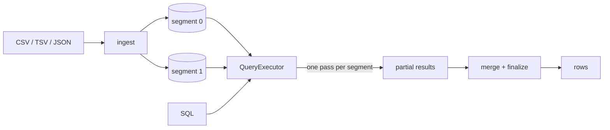

<p align="center">
  
</p>

# MastiDB - A 'serious' OLAP database engine written in python

MastiDB is an OLAP database engine, born from the adventurous journey of crafting a disk based OLAP database engine in Python (mypyc). 

It's written in a way that's easy to get, perfect for anyone who's ever wondered, "How do databases actually work?".
See for yourself how we're mixing simplicity with serious database chops.


## Why?
For me, MastiDB is more than just building a database; it's an exploration into the core mechanisms of columnar databases. It's about uncovering the secrets behind a database's ability to swiftly process and sift through terabytes of data within seconds. 

The journey thus far has been immensely rewarding. I have witnessed performance enhancements exceeding 90% compared to the initial V0 design, all by tweaking and fiddling with the little things at the heart of it all.

## How does it actually work?

The short version: every column lives in its own file, dictionary-encoded, with a roaring bitmap index for each distinct value. `WHERE` never scans a column — it turns into bitmap lookups and intersections. Grouping happens on integer dictionary ids and only decodes back to strings once, at the end. A table can be split into multiple segments, each of which answers a query independently and hands back a partial result for the engine to merge.



The long version — folder layout, the actual bytes inside a `.mastidb` file, the ingestion path, both query paths, and what each choice costs in time and space — is in [**ARCHITECTURE.md**](ARCHITECTURE.md). That's the document I wish existed for every database I've tried to read.

Also worth a look:

- [ROADMAP.md](ROADMAP.md) — what's missing, and what's next
- [CONTRIBUTING.md](CONTRIBUTING.md) — setup, tests, and how to send a PR

## Getting Started
MastiDB can be used in two primary ways: as a library in your Python projects or via its command line interface (CLI) for direct interaction. Here's a quick guide to get you started:

### Installation
You can install mastidb from pip like regular people would. Needs Python 3.9 or newer.
```sh
pip install mastidb
```

Installing compiles the hot modules with [mypyc](https://mypyc.readthedocs.io/), so it takes a minute and wants a C compiler. If you don't have one, the build steps aside and you get the pure-Python version — same behaviour, just slower.

If you're feeling tweaking the codebase, I'd encourage you to install from source.

```sh
git clone https://github.com/lokeshdevnani/mastidb.git
cd mastidb
pip install -r requirements.txt
pip install -e .
mastidb --help
```

### Using CLI
**Ingesting a file via CLI.**

Supports CSV, TSV, JSON, ndJSON

```sh
mastidb ingest -d /path/to/a/new/dir -s /path/to/source/file.csv
mastidb ingest -d /path/to/a/new/dir -s /path/to/source/file.csv --segments 4
```

**Running SQL queries**

```sh
mastidb query -d /path/to/mastidb/dir "SELECT COUNT(id)"
mastidb console -d /path/to/mastidb/dir
```
`query` prints one result and exits. `console` opens the REPL.

```
MastiDB > select count(id)
                              MastiDB
                            ┏━━━━━━━━━━━┓
                            ┃ COUNT(id) ┃
                            ┡━━━━━━━━━━━┩
                            │ 1334792   │
                            └───────────┘
Fetched 1 rows. Took 2.12 seconds. CPU time 1.99
```

## Usage as a library

Everything hangs off two objects: a `Table` (your data on disk) and a `QueryExecutor` (the thing that runs SQL against it).

Ingestion
```python
from mastidb import Table

# Read a file and write out a fresh table
table = Table.from_ingest_source('/tmp/menuitem', 'tests/dataset_menu/MenuItem.csv')

# Or split it into segments while ingesting - each one gets queried independently
table = Table.from_ingest_source('/tmp/menuitem', 'tests/dataset_menu/MenuItem.csv', num_segments=4)
```

Querying
```python
from mastidb import QueryExecutor, Table

table = Table.from_data_dir('/tmp/menuitem')
results = QueryExecutor(table).execute(
    "SELECT menu_page_id, COUNT(id) GROUP BY menu_page_id ORDER BY COUNT(id) DESC LIMIT 10"
)

print(results.columns)        # ['menu_page_id', 'COUNT(id)']
print(results.get_results())  # [['1207', 87], ['98', 71], ...]
```

If you just want to point at a directory and run a query, there's a shortcut that skips loading the table yourself.

```python
QueryExecutor.from_data_dir('/tmp/menuitem').execute("SELECT COUNT(id)")
```

### What you can ask it

```sql
SELECT cityName, added WHERE countryName = 'India' ORDER BY added DESC LIMIT 5
SELECT COUNT(id)
SELECT menu_page_id, COUNT(id), SUM(price), AVG(price) GROUP BY menu_page_id
SELECT COUNT(DISTINCT dish_id)
SELECT cityName, added + deleted ORDER BY added + deleted DESC LIMIT 10
```

So: `SELECT`, `WHERE` (equality, `AND`, `OR`), `GROUP BY`, `ORDER BY`, `LIMIT`, and `COUNT` / `SUM` / `AVG` / `COUNT(DISTINCT)`. A query without a `LIMIT` gets an implicit one, since there's no cursor to stream results through yet.

Not there yet: joins, subqueries, `HAVING`, range and `IN` filters, and real data types — everything is stored as a string dimension today. [ROADMAP.md](ROADMAP.md) keeps the honest list.

**Please Note**: MastiDB is currently not intended for production use. The API is in a state of evolution and might undergo significant changes.

It's a great tool for learning and experimentation, but we recommend not using it for critical applications at this stage.


## Contributing
MastiDB is still a baby, just getting its bearings. If you're into databases and love tinkering, give it a shot! 
Just fork the repo, do your magic, and hit me up with a pull request. [CONTRIBUTING.md](CONTRIBUTING.md) has the setup and test bits.

## License
MastiDB is proudly released under the MIT License. This is pretty much as liberal as it gets – you're free to do almost anything you want with this project. Use it, change it, share it, or even sell it; just make sure to include the original copyright and license notice in your copies. 
