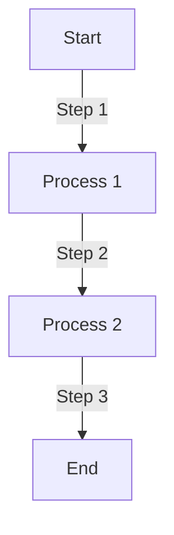

## TODO

1. Support for segment column types = [dimensions, metrics]
2. Support for COUNT(*) and COUNT(DISTINCT field)
3. Support for LIMIT and ORDER
4. Implement logging and monitoring for IOPS tracking
5. Add limits for the metadata fields according to datatype used and raise Errors if crossed.

## Done
1. Implement SQL parser -> sqlparse
2. Add ResultRow which includes all select columns in order.
3. Dictionary optimisation
   1. Keep a offset list to dictionary element start index
   2. Remove the length prefix
4. Implement MMAP for file reading - https://realpython.com/python-mmap/

## Flowchart Example

